# Bridging Modules Labs
## Student Information ## 
Student Name : LEE WEI HANG\
Kaplan Student ID : CT0381772\
Murdoch Student ID : 36060222

----------

# Session 1 
## Session 1a - Setting Up Linux ##
* Successfully installed VirtualBox as VirtualMachine
* VirtualBox - https://www.virtualbox.org/
* Downloaded ubuntu-24.04.4-desktop-amd64
* Ubuntu - https://ubuntu.com/download/desktop
* config VM with 8192MB Base Memory and 2 Processors core
* Succesfully booted and ran Ubuntu on VirtualBox


## Session 1a - Basic command line navigation and utilities.
- `pwd` - prints current working directorys
  - helps to show output of the current path
  - Exmaple : `/home/ubuntu`

- `ls` - list files and directory 
  - Shows all current path directory content
  - Examples:
    - `ls` -> to show basic lsiting
    - `ls -a` -> show all entires including hidden files
    - `ls -l` -> used a long list format showing all detailed information
  - Writting in `ls -al` allows to show all hidden files with their detailed information

- `cd` - Changes directory or Directory Navigation
  - Goes to a specific Directory
  - Examples:
    - `cd Documents` -> goes to Documents directory
    - `cd ..` -> return to prev directory
    - `cd ~` -> return to home directory (e.g `/home/ubuntu`)

- `mkdir` - Creates a new directory
  - Examples:
    - `mkdir dlr1` -> creates a new directory name dlr1
 
- `touch` - Create an empty file
  - Examples
    - `touch test` -> create test file(empty)
    
- `man` - shows manual
  - Examples
    - `man ls` -> shows manual of ls
    - `man man` -> shows manual of manual
    
- `mv` - move a file or directory
  - Examples:
    - `mv test dlr1` -> move test file into dlr1
    - `mv dlr1/test /home/ubuntu` -> move test file from dlr1 to /home/ubuntu
      
- `/` - root directory also known as base of the file
  - Basically to include it infront of a directory and use cd to access it.

- `ping` - Check connection
  - `ping www.google.com` - continuously check connection with google

- `echo` - display text
  - `echo "Hello World" > text.txt` - pipe text "Hello World" into text directory

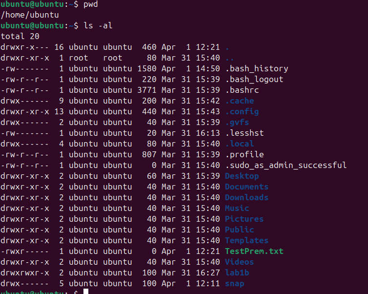
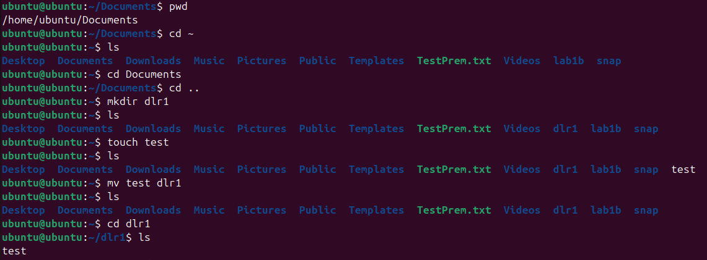
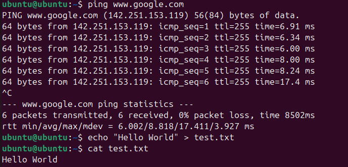

## Session 1b : Linux Services
- Install apache and start it `sudo apt update`,`sudo apt install apache2 -y`,`sudo systemctl start apache2`
- Tested on web `http://127.0.0.1`
- Install SSH and Nmap `sudo apt install openssh-server nmap -y`
- Get IP address `ip a` ~ `10.0.2.12`
- Scan ports with nmap `nmap 124.0.0.1`
- Edited the webpage ~ `sudo nano index.html`
- Enabled firewall allowing http ports `80` ~ `sudo ufw enable`,`sudo ufw allow 80`
- Downloaded books from Project Gutenberg using `wget https://www.gutenberg.org/files/1342/1342-0.txt`
- Create a directory adn archieve files using tar `tar -cf Books.tar Books`
- Compress to `bzip2 Books.tar` 
- Decompress `bunzrip2 Books.tar.bz2`.`tar -xvf Books.tar` 


## Session 1b : Linux Searching Filesystems
- Creating files for searching.
  - `mkdir lab1b` -> Creates a diretory
  - `touch file.txt file2.txt notes.log` -> creates 3 empty files for future uses.
  - `echo "Hello World" > file1.txt` -> pipe text into .txt file
  - `echo "This is Lab 1 B" > file2.txt` -> pipe text into .txt file
  - `echo "Error" > notes.log` -> pipe text into .log file to show error later.
- `find [path] -name "filename` -> find function to find a path of A specific file
  - `. -name "file.txt"` -> shows file1.txt path
  - `. -name "*.txt"` -> shows all .txt file path
  - `. -type d` -> shows directories
- `grep` -> search inside the files
  - `grep "Lab" file2.txt` -> prints line and highlight the search text inside the file
  - `grep -i "LAB" file2.txt` -> same as previopus byt case insensitive search
  - `grep "Hello *` -> case sensitive search shows file name and highkighted text inside
  - `grep -r "Error"` -> perform a recursive search through all files and display case sensitive
- Combitionation uses of grep and find
  - `find . -name "*.txt" -exec grep "Lab" {} \;`
    - Searches all the txt file and execlude the file that contains the word Lab.


## Session 1b : Permission
Understanding permission
- 3 types of group
  - User (owber)
  - Group
  - Others 
- 3 types of permision
  - r = read
  - w = write
  - x = execute
Combining everything together gets\
rwx-rwx-rwx\
 U   G   O\
U - User\
G - Group\
O - other\

- `touch TestPrem/txt` Creating a dummy file
- `ls -l` -> View permission 
- Change Permission
  - Numeric System!
    - r = 4 , w = 2, x = 1  
      - 7 -> rwx (read, write, execute)
      - 6 -> -rw (read, write)
      - 5 -> r-x (read, execute)
      - 4 -> r-- (read)
      - 0 -> --- (No permission)
  - `chmod 777 TestPrem.txt` -> give full permission to all user to read write and execute the file
  - `chmod 444 TestPrem.txt` -> make file read-omly for all user
  - `chmod 755 TestPrem.txt` -> give gull permission to user BUT read and execute only for group AND OTHER
  - `chmod 740 TestPrem.txt` -> make file read-omly for all user
  
- Symbolic mode -> allows adding or removing premission specifically.
- `-` to revoke a permission
- `+` to add a permission 
  - `chmod u+x TestPrem.txt` 
  - `chmod g-w TestPrem.txt`

- Change Ownership!
  - `sudo chown ubuntu:ubuntu TestPrem.txt` -> give premision to user ubuntu
  - `sudo chown $USER:$USER TestPrem.txt` -> automatically check and uses current username

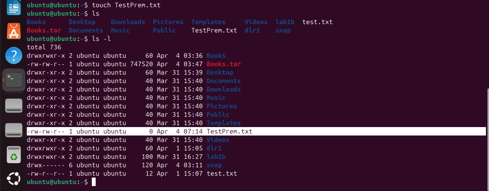
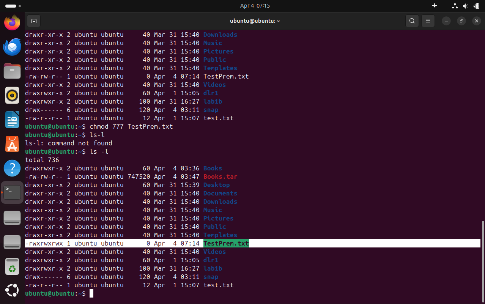
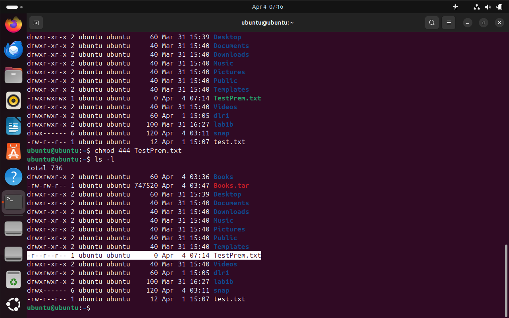
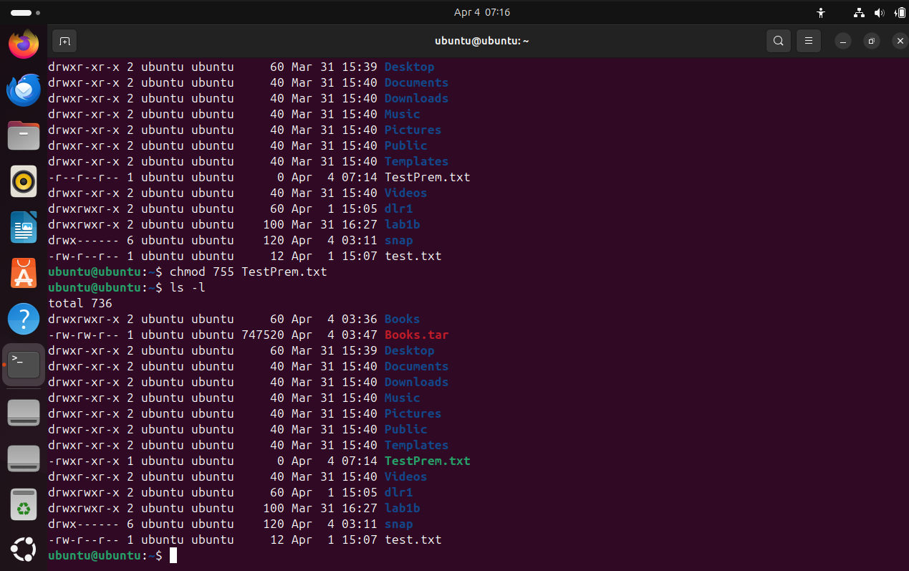
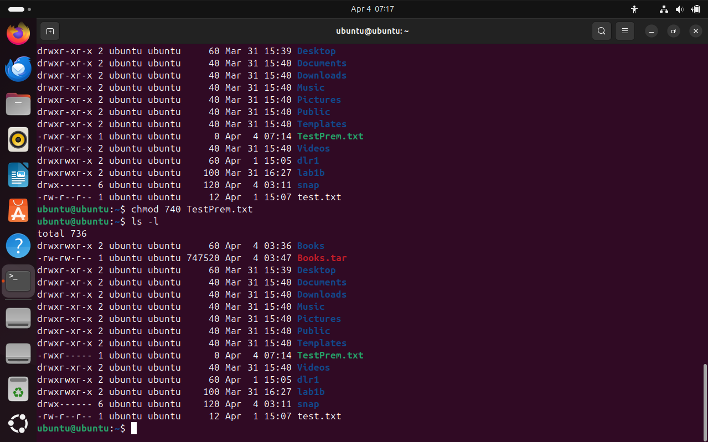
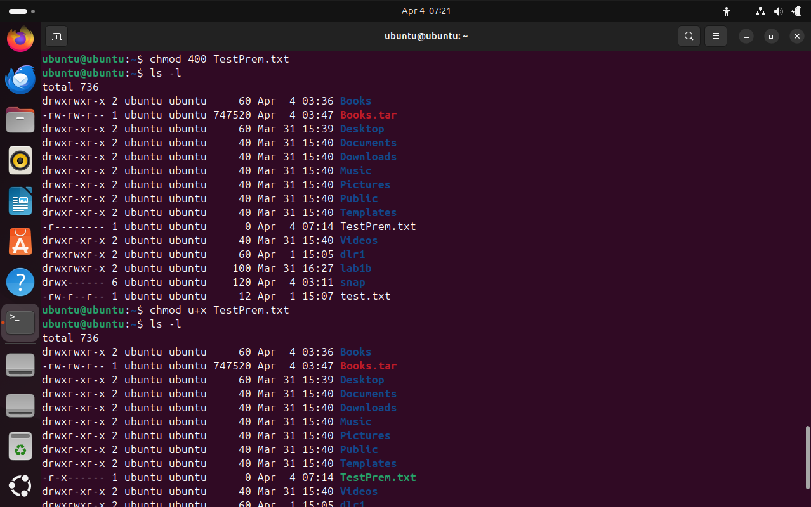

----------

# Session 2 
## Session 2a : Total Cost of Ownership (TCO)
- TCO - Total Cost of Ownership
  - Comporison of 2 different types of printer for 5 years
    - Printer A -> BROTHER DCP-L2640DW Laser Printer
    - Printer B -> Epson EcoTank L4360
- Assumptions
  - Printer prints 750 pages/week
  - Power on 40 hrs power/week
  - Calculated for 5-year period
  - Electric consumtion SGD $0.29/kWh (From SP Group)
- InkJet shows a better result for the TCO
- Tables and calculation are made via ~ Microsoft Excel


## Session 2b : Cloud Services
- Succesfully deployed VM using Azure for Student
  - VM Name : Lab2-Ubuntu
  - Region  : Southeast Asia
  - OS      : Linux
  - Size    : Standard D2s v3 (2 vcpus, 8 GiB memory)
- Connected to windows PowerShell terminal via : `SSH Command`
- Updates the System with `sudo apt update` & `sudo apt update -y`
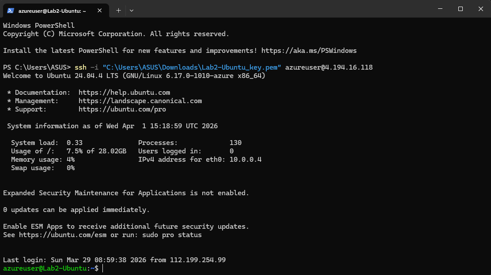
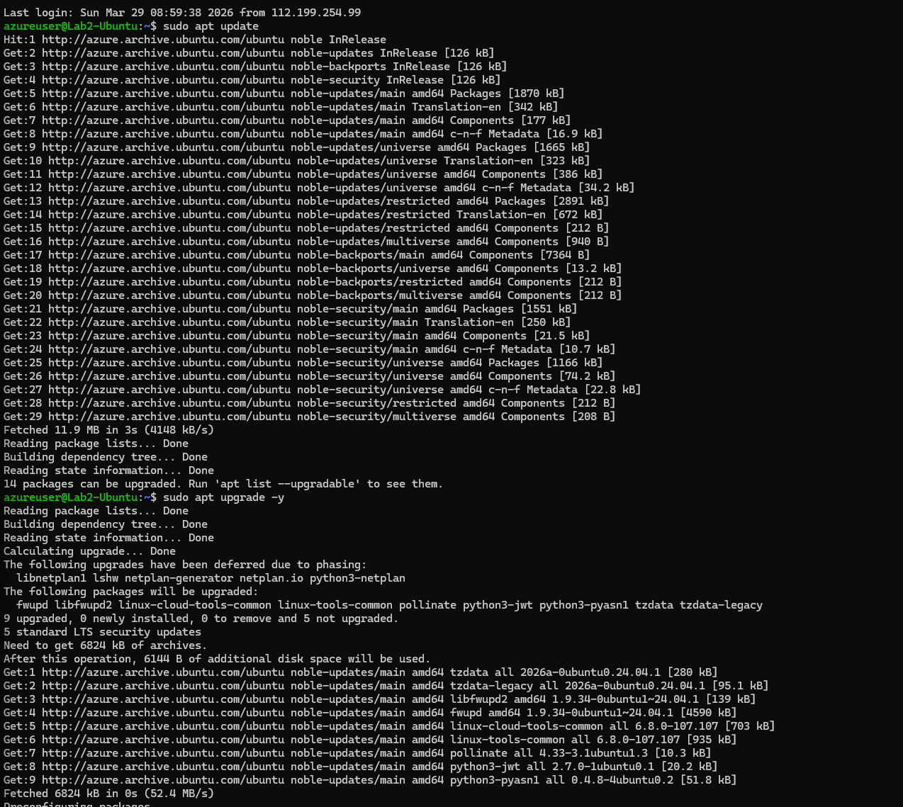

## Session 2b : Bash Scripting
- Create a working folder and first script
  - `mkdir bash_lab` -> Creates directory
  - `cd bash_lab`    -> go to directory
  - `touch hello.sh` -> Create the script


- Opening the script and writting into it
  - `nano hello.sh` -> edit the script
  - Write in the command  
```
#!/bin/bash
echo "Hello World" 
```
  - When run `bash hello.sh` -> it will output "Hello World"


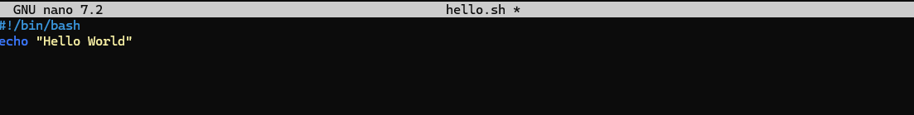
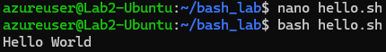

- making script executable
  - `chmod +x hello.sh` 
  - Run the script `./hello.sh`

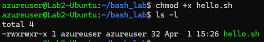
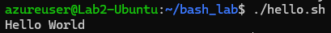

- Creating New Scripts
- If Statement
```
#Create the script (if statement)
nano if.sh

#!/bin/bash
num=10
if [ $num -gt 5 ]
then
  echo "Number is greater than 5"
fi

#run the script
bash if.sh
```
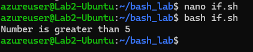

- For loop
```
#Create the script (for loop)
nano for.sh

#!/bin/bash
for i in 1 2 3 4 5
do
  echo "Number: $i"
done

bash if.sh
```
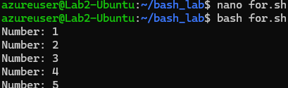

- While loop
```
#Create the script (while loop)
nano while.sh

#!/bin/bash
count=1
while [count -le 5]
do
  echo "Count: $count"
  count-$((count + 1))
done

bash while.sh
```
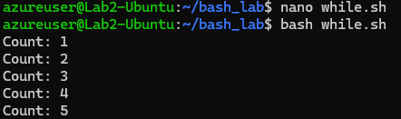

- Uses of `cron`
  - Cron works as an automatic command by running at a sepcific time repeatedly
  - It may be used for time based backup automatically to help humans
  - The below example show cron working every minute
- `crontab -l` -> list current cron
- `crontabh =r` -> remove cron

```
#Create a cron
crontab -e

#Choose option 1
1. /bin/nano

* * * * * echo "Cron is working" >> /home/azureuser/cron.txt

#go back to home directory and run
cd ~
cat cron.txt
```

----------

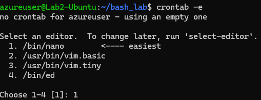
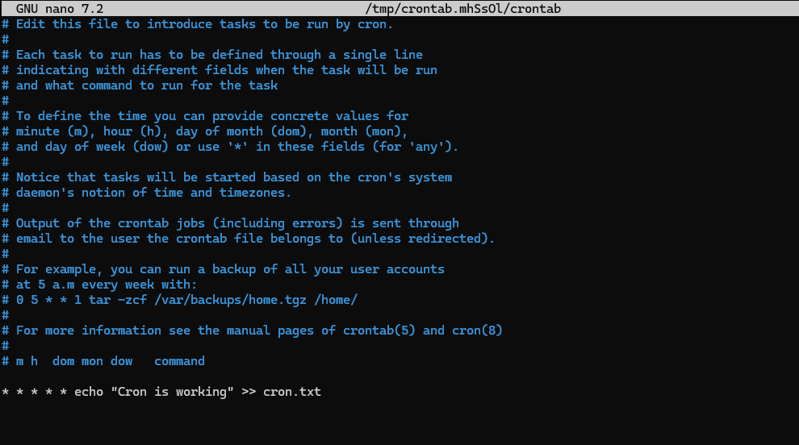
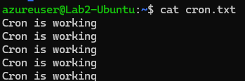
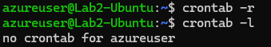

# Session 3
## Session 3a : DNS & Certificates
- registered a free domain for ~ duckDNS(www.duckdns.org)
- Created port 80(http) and port 443(https)
- Connected SSH into azure VM `ssh azureuser@4.194.16.118`
- install apache `sudo apt update` , `sudo apt install apache2 -y`
- start apache `sudo systemtcl start apache 2`
- Change current ip of `http://bridgingisea.duckdns.org/` to `4.194.16.118`
- verified DNS by using ping `bridgingisea.duckdns.org`
- Check and confirm working apache page at `http://bridgingisea.duckdns.org/`


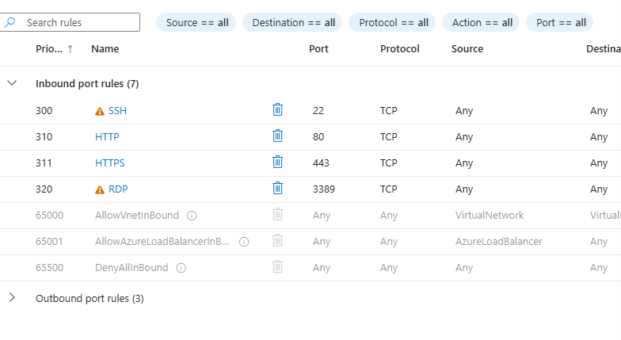
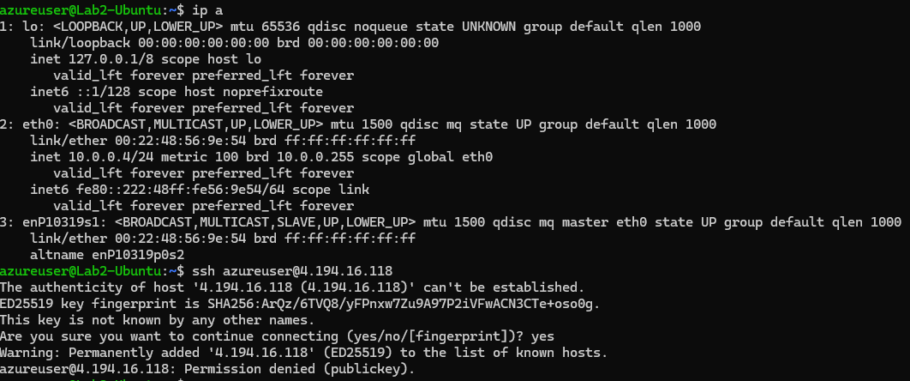
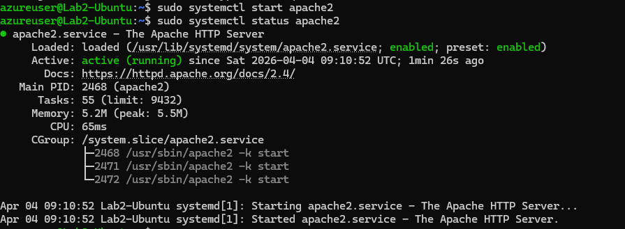
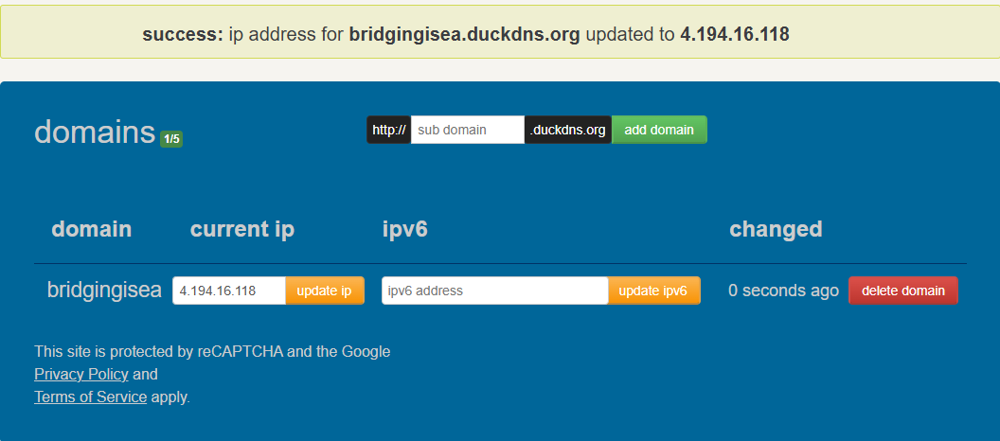
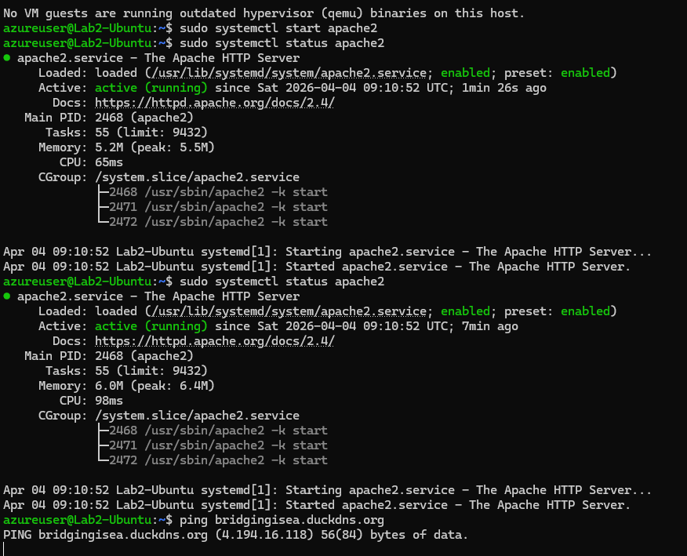
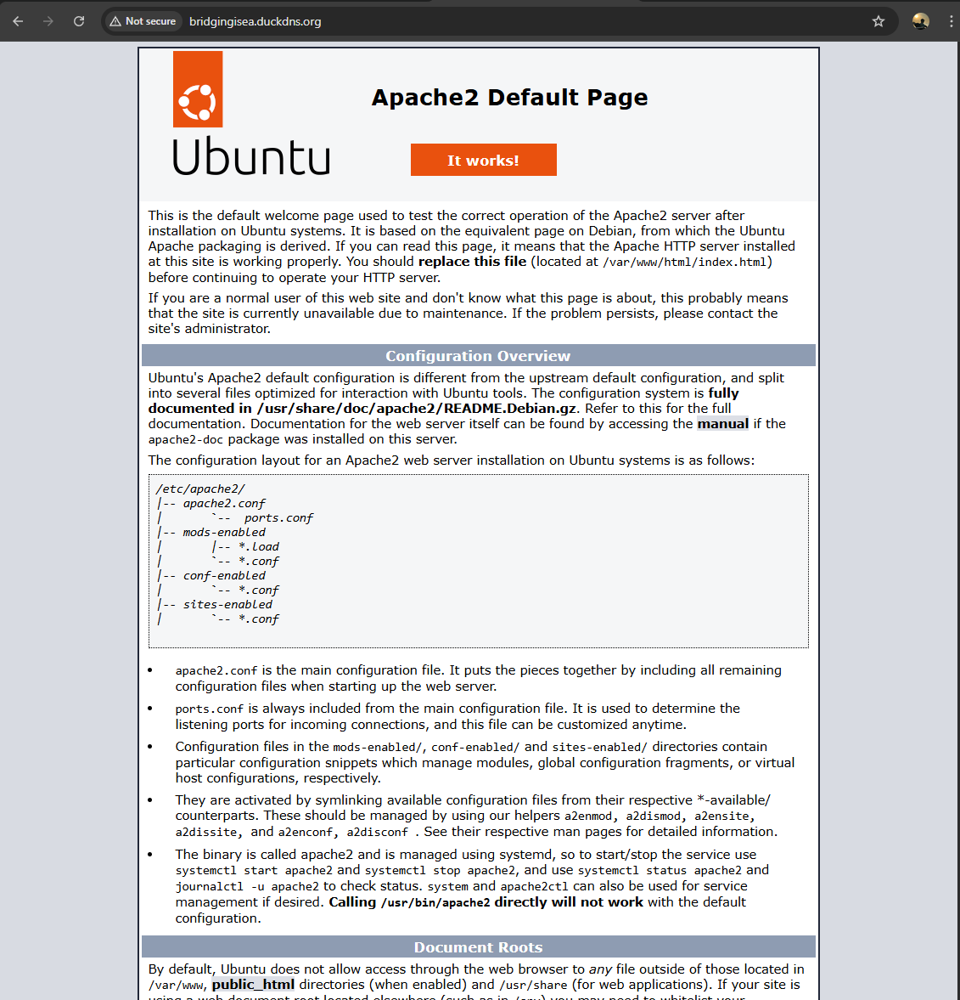

- Installed SSL Certificatte
- `sudo certbot --apache`
- HTTPS enabled `https://bridgingisea.duckdns.org/`

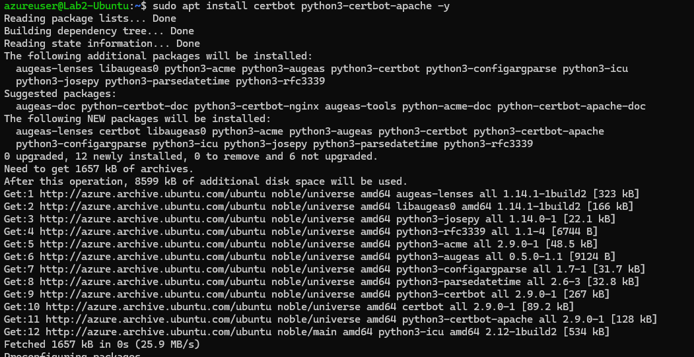
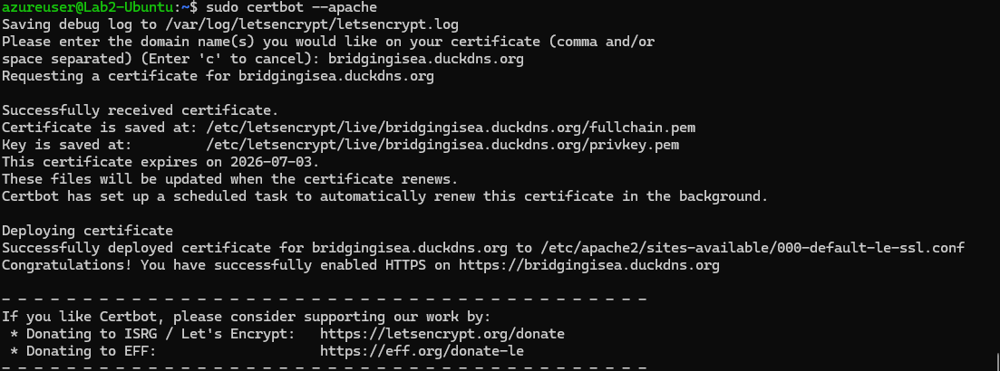
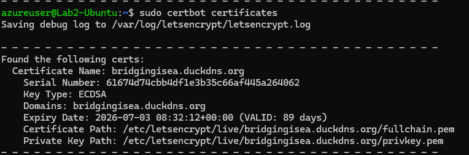

## Session 3b : Server Automation
- Creating test folderm files with some text.
  ```
  mkdir -p /home/azureuser/Documents/lab3b
  echo "File 1:" > /home/azureuser/Documents/lab3b/file1.txt
  echo "File 2:" > /home/azureuser/Documents/lab3b/file2.txt
  mkdir -p /home/azureuser/Documents/lab3b/subfolder
  echo "Nested file" > /home/azureuser/Documents/lab3b/subfolder/file3.txt
  
  #Create a backup folder
  mkdir -p /home/azureuser/backup
  ```
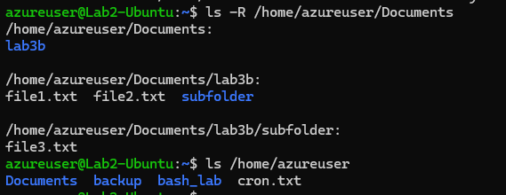
- writing a testscript to perform backup on Document folder
  ```
  #!/bin/bash
  
  now=$(date +"%d_%m_%y")
  
  mkdir -p /home/azureuser/backup
  cp -R /home/azureuser/Documents/* /home/azureuser/backup/
  
  cd /home/azureuser || exit
  zip -r "${now}.zip" /home/azureuser/backup/*
  
  cp "${now}.zip" /home/azureuser/
  echo "Backup completed: ${now}.zip"
  ```
- installed zip `sudo apt install zip -y`
- run `bash testcript`

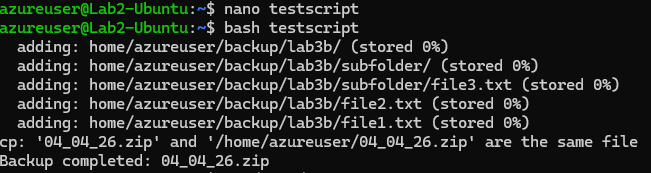

- Making it executable provide permission ~ `chmod 777 testcript`
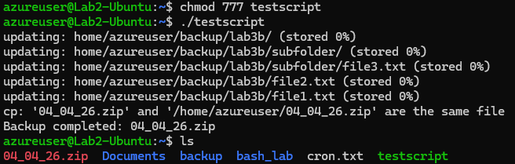

- move testsrcipt to `/usr/bin/testscript`
~ Allows to run system-wide
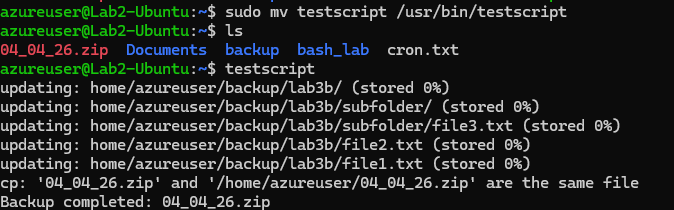

- Scheduling with cron
```
# runs every minute
sudo nano /etc/crontab
* * * * * azureuser /usr/bin/transcript
```
- `0` = minute 0
- `*` = every hour
- user = `azureuser`
- command = `/usr/bin/transcript`


- [Challenge]
  - Each Login will show figlet welcome and neofetch
  ```
  sudo apt install figlet neofetch -y
  nano ~/.bashrc
    figlet"Welcome"
    neofetch
  source ~/.bashrc
  ```
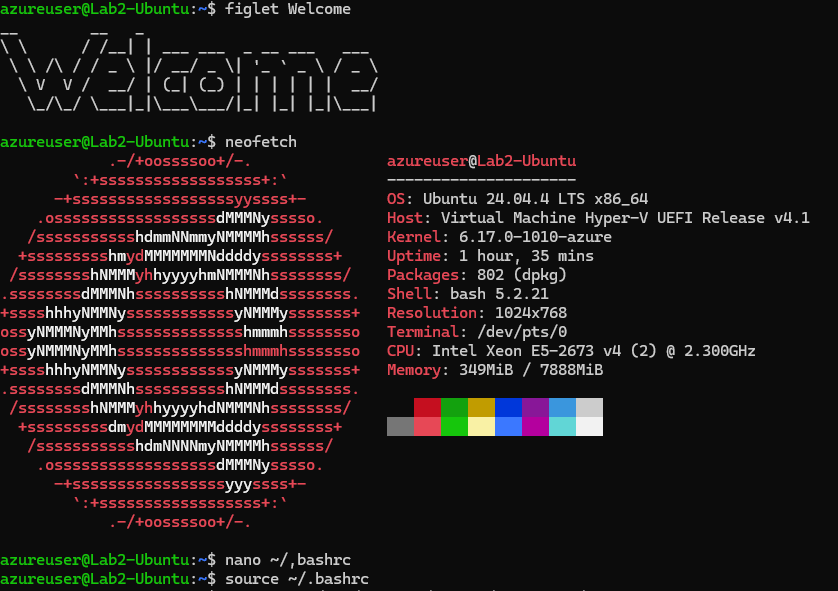
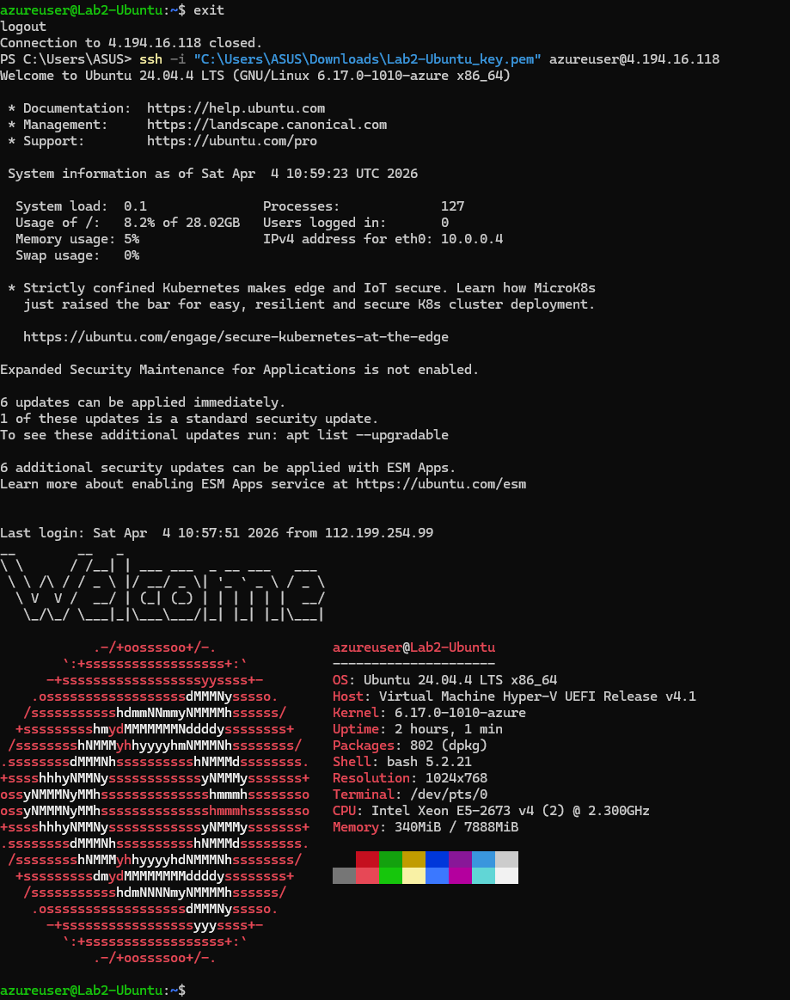

----------

# Sesssion 4 
## Additional Server Service (MariaDB)
- Intall MongoDB ~ `sudo apt install mariadb-server -y `
- Start and enable MariaDB ~ `sudo systemctl start mariadb`,`sudo systemctl enable mariadb`
- Verify MariaDB online ~ `sudo systemctl status mariadb`
- Secure the installation ~ `sudo mysql_secure_installation`
- Login to Mariadb : `sudo mysql`
- Created a Database and User.
```
CREATE DATABASE Lab4;
CREATE USER 'labuser'@'localhost' IDENTIFIED BY 'password123';
GRANT ALL PRIVILEGES ON Lab4.* TO 'labuser'@'localhost';
```
- Login as new created user ~ `mysql -u labuser -p`
- Create simple table and insert data.
```
USE Lab4;

CREATE TABLE students (
    id INT AUTO_INCREMENT PRIMARY KEY,
    name VARCHAR(50),
    grade CHAR(1)
);

INSERT INTO students (name, grade)
VALUES ('Micky', 'A'), ('John', 'B');
```
- Query Data : `SELECT * FROM student` ~ Returned 2 Row.
- MariaDB version: `15.1 Distrib 10.11.14-MariaDB`


